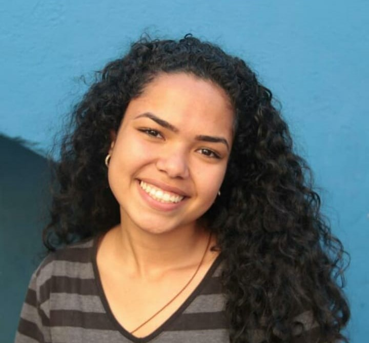

----

### Change language: <a href="https://github.com/nycolexavierr/01-github-explorer/blob/main/READMEeng.md" target="_blank">🇺🇸</a> 

### Cambiar idioma: <a href="https://github.com/nycolexavierr/01-github-explorer/blob/main/READMEsp.md" target="_blank">🇪🇸</a> 

### Application: 

Este projeto faz parte do desafio Daily UI <a href="https://www.dailyui.co/" target='_blank'> Aqui </a> 

 <a href="#Objective">Objetivo</a> •
 <a href="#Features">Features</a> • 
 <a href="#Technology">Tecnologia</a> •
 <a href="#License">Licença</a> • 
 <a href="#Author">Autor</a>

### Objetivo
Nesse repositório guardo todas as anotações, materiais e projetos que foram realizados no curso. 

### Features

- [x] Fazer o design no Figma
- [x] Codificar o design

### Tecnologia

As seguintes ferramentas foram usadas na construção do projeto:

- [Discover](https://app.rocketseat.com.br/discover)
- [Visual Studio Code](https://code.visualstudio.com/download)
- [ReactJs](https://reactjs.org/docs/getting-started.html)

### License

MIT License ©

### Autora
---

<a href="https://nycole-xavierr.medium.com/">

 
<b>Nycole Xavier</b></a> <a href="https://nycole-xavierr.medium.com/" title="Medium">👩‍💻</a>

Feito com ❤️ por Nycole Xavier 👋🏽 Entre em contato!

